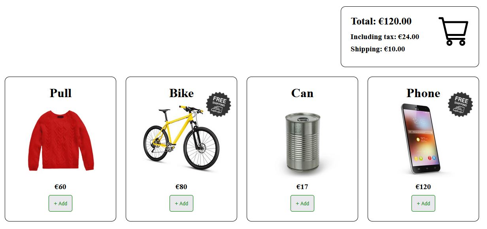

# Functional refactoring

The code in `script.js` is structured around global states.
The goal is to keep the behavior while getting rid of everything that is implicit.

## Business rules
 
- Display a "Free Shiping" icon near an item
when the price of this item + the current amount of the cart is greater or equal to €200.

- The tax (VAT) is displayed separately and corresponds to 20% of the cart's amount.

- Once an item has been added to the cart, the shipping cost is €10, unless the current amount of the cart is greater or equal to €200.

- Once the shipping is free, the "Free Shipping" icons are hidden

### Example:

- the cart contains contains 1 item priced €120
- the cart total is €120
- the tax total is €24
- the shipping cost is €10
- an item costing €60 is not displaying any additional info
- an item costing €80 is displaying a Free shipping icon
- an item costing €17 is not displaying any additional info
- an item costing €120 is displaying a Free shipping icon

## Info

No need to change the support files `Dom.js` or `index.html` (or any other file than `script.js`) from the project.

The goal is not to change how the DOM is manipulated but how the business logic is structured inside `script.js`.

### Launch server
You can launch the web app with the command:
`yarn start` or `npm start`

### Launch e2e test suite
You can also use the provided e2e test suite to check nothing has been broken during the refactoring:
First install the dependencies: `yarn` or `npm i`
Finally run the tests: `yarn test` or `npm t`
